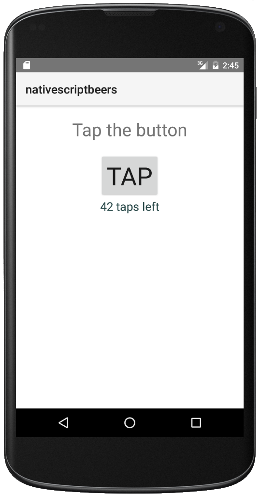

**NativeScript Beers** is a tutorial of the [Beer Tutorials](http://www.beer-tutorials.org) series.
In this tutorial we will create a simple app that queries a beer catalog and displays a list of beers.

## Getting Started

Install [NodeJS](https://nodejs.org/) and then using the node package manager (npm), install native script.

```
npm install -g nativescript
```

After installing native script, create a new project called `nativescript-beers`.

```
tns create nativescript-beers
```

Navigate to the project directory and add the mobile development platform.

```
tns platform add android
```

Run the application on the Android emulator.

```
tns run android --emulator
```

> Note: To run the application in the Android emulator, you need to have the Android SDK
> installed and configured on your computer.
> The easiest way to do it is to install [Android Studio](http://developer.android.com/tools/studio/index.html)
> for your platform.
>
> If you find issues while initializing the app, read carefully [these instauctions](http://docs.nativescript.org/setup/ns-cli-setup/)




## Project Structure


    .
    └── nativescript-beers
        ├── app
        │   ├── App_Resources
        │   │   ├── Android
        │   │   └── iOS
        │   ├──  main-page.js
        │   ├──  main-page.xml  
        │   ├──  main-view-model.js  
        │   ├──  package.json  
        │   ├──  references.d.ts
        │   ├── app.css
        │   ├── app.js
        │   └── ...
        ├── node_modules
        │   └── tns-core-modules
        ├── package.json
        └── platforms
            ├── android
            └── ios    


Inside  the project folder there are 3 sub-folders: `app`, `lib` and `platforms`. The application source code resides in the `app` folder. Application code is written using JavaScript and the user interface designed using XML.

Inside the `app` folder is a file called `main-page.xml` which has the default user interface code. In `main-view-model.js` is the default model code and` main-page.js` defines the application logic. Finally `app.js` contains the code to start the application with the defined modules.


## Designing the app

Let’s start by designing the application using XML. Open `main-page.xml` and look at the default code. Remove everything except the `Page` tag. The `Page` tag has an attribute called `loaded` which executes the `pageLoaded` function once the app loads. The `pageLoaded` function is inside the `main-page.js` file.

This project will use a *stack layout* to design our app. There are [a number of layouts offered by native script](http://docs.nativescript.org/layouts).

Inside the Page tag add the stack layout.


```
<StackLayout orientation="vertical">

</StackLayout>
```


Define the stack layout with a vertical orientation. Add a button inside the stack layout.


```
<Button text="Get beer list" height="50px" style="width:300px;border:none;font-size:20px;" />
```


Save changes and run the app. It should look something like the below.


## Fetching data from Beer catalog

Add an attribute called `tap` to the *Get beer list* button.


```
tap="beers"
```


Now, when the user taps the search button the `beers` function is called.
Let’s define the `beers` function inside` main-page.js`.


```
exports.beers = function() {
  // Code would be here !
};
```


Calling the API will require the `http` module, so import the module into `main-page.js`.


```
var http = require("http");
```


Inside the `beers` function, and using the `http` module, now make the API call.
For the needs of this tutorial, the beer catalog is a JSON file on
`{{ site.baseurl }}/beers/beers.json`.


```
http.getJSON("{{ site.baseurl }}/beers/beers.json").then(function(r) {

    console.log(JSON.stringify(r));

}, function(e) {

    console.log(e);

});
```


The code above makes the API call with the search text hard coded for now, this will become dynamic later in the tutorial.

When running an app in the emulator you will need to run ‘adb logcat’ to check log messages.

Save changes and run the app on the emulator. Click the search button and the returned result from Flickr should be visible in terminal.

Next create the image url using the response returned and push the URL to the images array.

An observable array is required to create and detect changes to a collection of things. Bind this same observable array to the view so that the view updates whenever a change occurs.

To create the observable array, add these variable declarations to main-page.js :

var observableArray = require("data/observable-array");
var images = new observableArray.ObservableArray([]);
Based on the response returned from the API request, the next task is to create the flickr image URL. Detailed information can be found here about creating flickr URLs.

Next, we iterate through the returned data, create the image URLs and push to the images array. Add this code inside the signin function.

var imgUrl = '';

var photoList = r.photos.photo;

for (var i = 0; i < photoList.length; i++) {
    imgUrl = "https://farm" + photoList[i].farm + ".staticflickr.com/" + photoList[i].server + "/" + photoList[i].id + "_" + photoList[i].secret + ".jpg";

    images.push({
        img: imgUrl
    });

}
