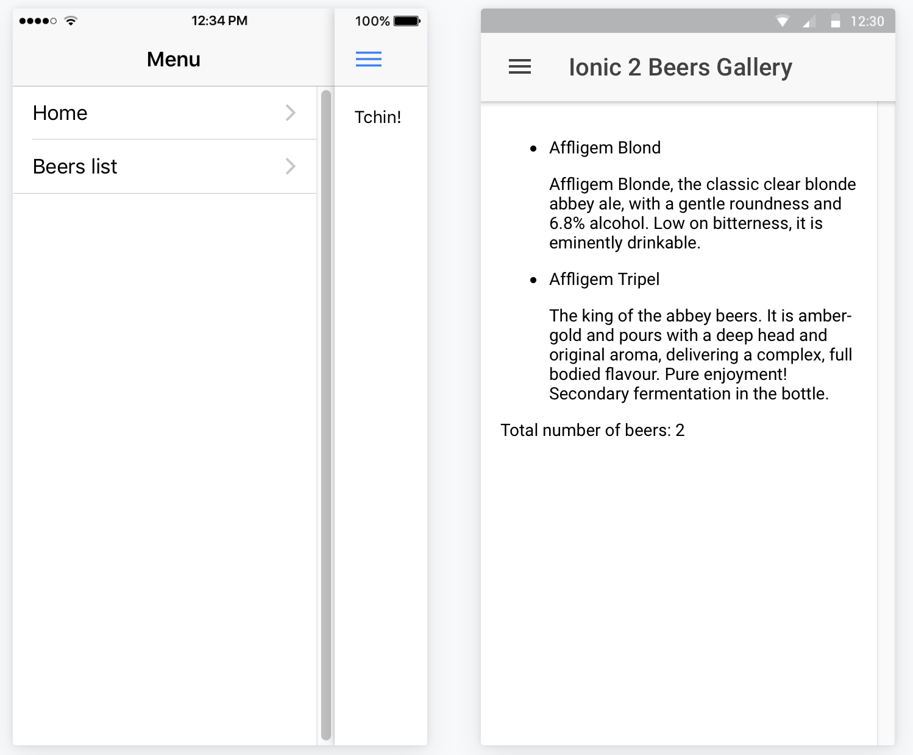
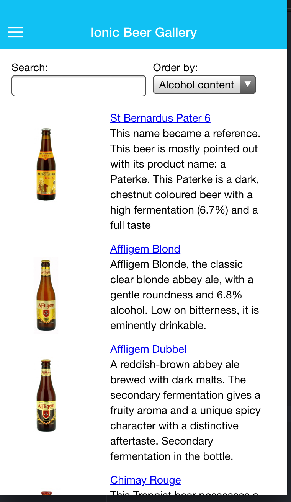

# Ionic 2 Beers

**Ionic Beers** is a tutorial of the [Beer Tutorials](http://www.beer-tutorials.org) series.
In this tutorial we will create a simple app that queries a beer catalog and displays a list of beers.

## Getting Started

Install [NodeJS](https://nodejs.org/) and then using the node package manager (npm), install ionic and cordova.

```
npm install -g ionic cordova
```

After installing ionic, create a new project called `ionic2-beers`.

```
ionic start ionic2-beers blank --v2
```

Navigate to the project directory and add the mobile development platform.

```
ionic platform add android
```

Run the application on the Android emulator.

```
ionic emulate android
```

Run the application on desktop browser
```
ionic serve --lab
```


> Note: To run the application in the Android emulator, you need to have the Android SDK
> installed and configured on your computer.
> The easiest way to do it is to install [Android Studio](http://developer.android.com/tools/studio/index.html)
> for your platform.
>
> If you have issues while initializing the app, read carefully [these instructions](http://ionicframework.com/docs/getting-help/)

## Project Structure

    .
    └── ionic2-beers
        ├── hooks
        │   ├── after_prepare
        │   │   └── ...
        │   └── README.md
        ├── node_modules
        │   ├── ...
        │   └── ...
        ├── platforms
        │   ├── android
        │   │   └── ...
        │   ├── ios
        │   │   └── ...
        │   └── platform.json
        ├── plugins
        │   ├── ...
        │   ├── fetch.json
        │   └── ios.json
        ├── resources
        │   ├── android
        │   │   └── ...
        │   ├── ios
        │   │   └── ...
        │   ├── icon.png
        │   └── splash.png
        ├── src
        │   ├── app
        │   |     ├── app.component.ts
        │   |     ├── app.html
        │   |     ├── app.module.ts
        │   |     ├── app.scss
        │   |     └── main.ts
        │   ├── assets
        │   |     └── icon
        │   |           └── favicon.ico
        │   ├── pages
        │   |     └── home
        │   |           ├── home.html
        │   |           ├── home.scss
        │   |           └── home.ts
        │   ├── theme
        │   |     └── variables.scss
        │   ├── declaration.d.ts
        │   ├── index.html
        │   ├── manifest.json
        │   └── service-worker.js
        ├── typings
        │   └── cordova-typings.d.ts
        ├── www
        │   ├── index.html
        |   ├── manifest.json
        |   └── service-worker.js
        ├── package.json
        ├── config.xml
        ├── ionic.config.json
        ├── tsconfig.json
        └── tslint.json


Inside  the project folder there are 8 sub-folders: `hooks`, `node_modules`, `platforms`, `plugins`, `resources`, `src`, `typings` and `www`. The application source code resides in the `app` folder. Application code is written using Angular2 and Typescript.

Inside the `src` folder is a file called `index.html` which has the default application code. Finally `app/main.ts` contains the code to start the application with the defined modules.


## Designing the app

### Beers list

We need to create a new page to list the beers in the application. For that, we're going to use Ionic CLI to generate pages with command

```
ionic generate page beers
```

Open `pages/beers/beers.html` and add the code which define the beers list to display.

```
<ion-content padding>
    <ul>
        <li>
            <span>Affligem Blond</span>
            <p>
                Affligem Blonde, the classic clear blonde abbey ale, 
                with a gentle roundness and 6.8% alcohol. Low on bitterness, 
                it is eminently drinkable.
            </p>
        </li>
        <li>
            <span>Affligem Tripel</span>
            <p>
                The king of the abbey beers. It is amber-gold and pours with a 
                deep head and original aroma, 
                delivering a complex, full bodied flavour. Pure enjoyment! Secondary 
                fermentation in the bottle.
            </p>
        </li>
    </ul>

    <p>Total number of beers: 2</p>
</ion-content>
```

Now, we need to add this new page to the application. Open `app/app.component.ts` and add after the import of the HomePage

```
import { BeersPage } from '../pages/beers/beers';
```

Open `app/app.module.ts` and add after the import of the HomePage

```
import { BeersPage } from '../pages/beers/beers';
```

Add the BeersPage in `declarations` and `entryComponents`

Save changes.

### Menu

First, we're going to add the menu to the app. For that, open `app/app.html` and replace code

```
<ion-menu [content]="content">
    <ion-header>
        <ion-toolbar>
            <ion-title>Menu</ion-title>
        </ion-toolbar>
    </ion-header>

    <ion-content>
        <ion-list>
            <button menuClose ion-item *ngFor="let p of pages" (click)="openPage(p)">
        {{p.title}}
      </button>
        </ion-list>
    </ion-content>

</ion-menu>

<!-- Disable swipe-to-go-back because it's poor UX to combine STGB with side menus -->
<ion-nav [root]="rootPage" #content swipeBackEnabled="false"></ion-nav>
```

Now, we need to add the reference to the menu in the application pages. Open `pages/beers/beers.html` and add this code at the beginning of the page

```
<ion-header>
    <ion-navbar>
        <button ion-button menuToggle>
      <ion-icon name="menu"></ion-icon>
    </button>
        <ion-title>Ionic 2 Beers Gallery</ion-title>
    </ion-navbar>
</ion-header>
```

Do the same for `pages/home/home.html`.

Open `app/app.component.ts` and add this code in the constructor 

```
    this.pages = [
      { title: 'Home', component: HomePage },
      { title: 'Beers list', component: BeersPage }
    ];
```

Save changes and run the app. It should look this way.




## Fetching data from Beer catalog

## Translate labels

Now the application needs to be translated for users all around the world. For this, add `ng2-translate` library with this command and update bower configuration

```
npm install ng2-translate --save
```

Open `app.js` file  and update

```
angular.module('ionicbeers', ['ionic','pascalprecht.translate'])
```

and add lines after `$urlRouterProvider`

```
// Translate labels / title / menus
$translateProvider.useSanitizeValueStrategy('escape');
$translateProvider.useStaticFilesLoader({declarations
    prefix: 'languages/',
    suffix:'.json'
});
$translateProvider
.registerAvailableLanguageKeys(['en','fr'], {
    'en_US': 'en',
    'en_UK': 'en',
    'fr_FR': 'fr',
    'fr_BE': 'fr'
})
.determinePreferredLanguage();

$translateProvider.use();
```

Open `index.html` and add lines to link script

```
<script src="lib/angular-translate/angular-translate.js"></script>
<script src="lib/angular-translate-loader-static-files/angular-translate-loader-static-files.js"></script>
```

Create new files that contain translated labels in a new directory `i18n`, for example `en.json`

```
{
	"menu" : "Menu",
	"home" : "Home",
	"beersList" : "List of beers",
	"beerGallery" : "Ionic Beer Gallery",
	"beersNumbers" : "Total number of beers",
	"content" : "Welcome!",
	"ionicBeers" : "Ionic Beers"
}
```

Update `home.html` file to translate labels

```
{{'content' | translate}}
```

Change all labels in `*.html` files to translate labels


## Order and search in list

Sometimes the list need to be ordered. AngularJS do this with easy directives.

Add lines in `controllers.js` file  after beers list initialization

```
$scope.orderProp = 'alcohol';
```

Open `listBeers.html` and add lines to filter beers

```
<div>
  {{'search' | translate}}: <input ng-model="query">
</div>
```

Add lines to sort beers

```
<div>
  {{'sortBy' | translate}}:
  <select ng-model="orderProp">
    <option value="name">{{'alphabetical' | translate}}</option>
    <option value="alcohol">{{'alcoholContent' | translate}}</option>
  </select>
</div>
```

After, add filter and sorter to the `ng-repeat` directive

```
<li ng-repeat="beer in beers | filter:query | orderBy:orderProp">
```

## Loading beers from JSON files

Add `$http` service in the controller definition and replace initialization of beers list  with loading JSON files

```
$http.get('beers/beers.json').success(function(data) {
  $scope.beers = data;
});
```


## Getting the beers pics

We can also extract the image URL from the received JSON and then we add the image to the `listBeers.html`:


```
<a href="#/beers/{{beer.id}}"></a>
<div class="thumb">
<a href="#/beers/{{beer.id}}">{{beer.name}}</a>
<p>{{beer.description}}</p>
</div>
```




## Let's display the beer description

On the beers list `listBeers.html`, add action on beer name and on picture

```

<a href="" ng-click="openModal(beer.id)">{{beer.name}}</a>
```

Now create new file `beer-detail.html` to display beer description

```
<ion-modal-view>
	<ion-header-bar align-title="left" class="bar-calm">
		<h1 class ="title">{{beer.name}}</h1>
		<button class="button icon ion-close" ng-click="closeModal()"></button>
	</ion-header-bar>

	<ion-content>
		
		<p class="description">{{beer.description}}</p>

		<ul class="beer-thumbs">
		  <li>
		    
		  </li>
		  <li>
		    
		  </li>
		</ul>

		<ul class="specs">
		  <li>
		    <dl>
		      <dt>{{'alcoholContent' | translate}}</dt>
		      <dd>{{beer.alcohol}}</dd>
		    </dl>
		  </li>
		  <li>
		    <dl>
		      <dt>{{'brewery' | translate}}</dt>
		      <dd>{{beer.brewery}}</dd>
		    </dl>
		  </li>
		  <li>
		    <dl>
		      <dt>{{'availability' | translate}}</dt>
		      <dd>{{beer.availability}}</dd>
		    </dl>
		  </li>
		  <li>
		    <dl>
		      <dt>{{'style' | translate}}</dt>
		      <dd>{{beer.style}}</dd>
		    </dl>
		  </li>
		  <li>
		    <dl>
		      <dt>{{'serving' | translate}}</dt>
		      <dd>{{beer.serving}}</dd>
		    </dl>
		  </li>
		</ul>
	</ion-content>
</ion-modal-view>
```

Define modal to display beer detail in `controllers.js`

```
$ionicModal.fromTemplateUrl('templates/beer-detail.html', {
  scope: $scope,
  animation: 'slide-in-up'
}).then(function(modal) {
  $scope.beerModal = modal;
});
```

Load beer definition from JSON file in `controllers.js`

```
$scope.openModal = function(beerId) {
  $http.get('beers/' + beerId + '.json').success(function(data) {
    $scope.beer = data;      
    $scope.mainImg = $scope.beer.img;

    $scope.setImage = function(img) {
      $scope.mainImg = img;
    }
  });
  myBeerId = beerId;
  $scope.beerModal.show();
};
```

Hide modal when click on close button in `controllers.js`

```
$scope.closeModal = function() {
  $scope.beerModal.hide();
};

$scope.$on('$destroy', function() {
  $scope.beerModal.remove();
});
```


